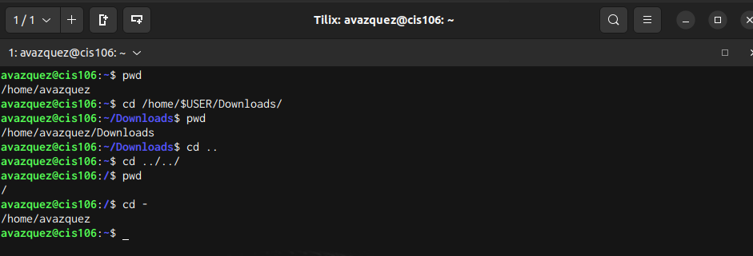

# Week Report 4 

## Practice from the presentation The Linux File system
### Practice 1 

 

### Practice 2

### Practice 3

## The Linux File system directories and their purpose

 

 

 

## All the commands for navigating the filesystem 

| Command | What it does                                           | Syntax                                   | Example          |
| ------- | ------------------------------------------------------ | ---------------------------------------- | ---------------- |
| pwd     | Prints current directory                               | pwd                                      | pwd              |
| cd      | Used for changing the current working directory        | cd + destination                         | cd Downloads/    |
| ls      | Used for showcasing all files in the current directory | ls     + option +      directory to list | ls -a ~/Pictures |

## Basic terminology

* **File system** The file system is how the files are stored and organized 
* **Current directory** is the directory one is currently working on 
* **Parent directory** backwards from the previous directory 
* **The difference between your home directory and the home directory** "Your home directory" is the terminal emulator which is the current working directory. Compared to "the home directory" it is the home directory in the root. 
* **Pathname** the location of the file in the file system 
* **Relative path** starts with a subdirectory and it is a directory that is found inside the current working directory 
* **Absolute path** always starts with / and it is the location of a file starting from the root of the file system