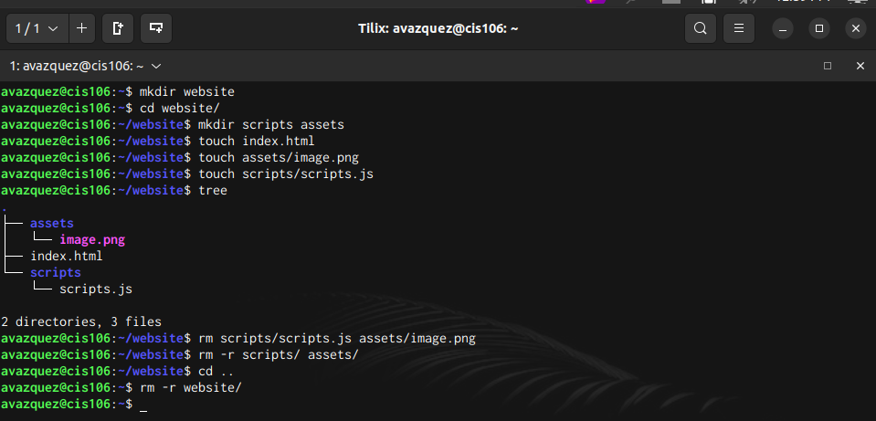
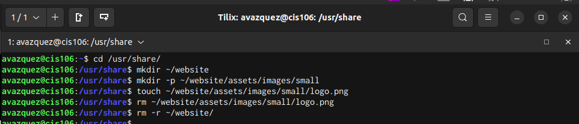
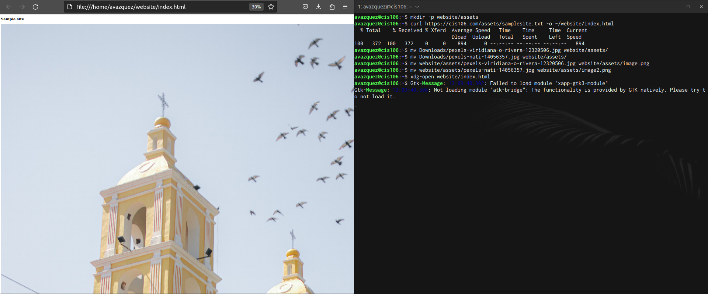
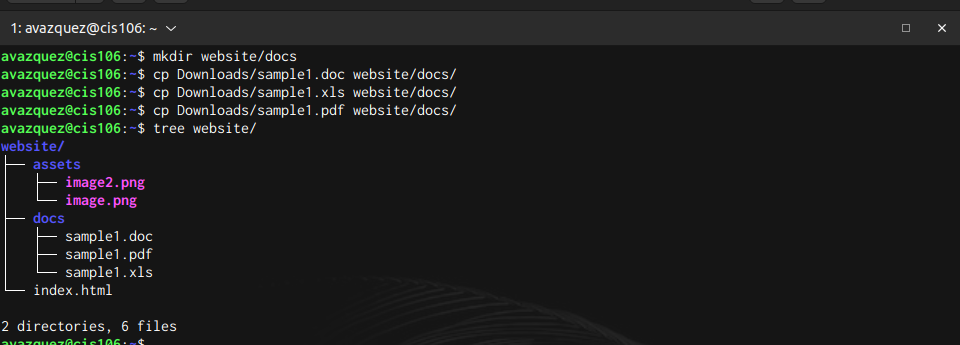

# Week Report 5

## Answers to the following questions:

* **What are Command Options?** The command options change/improve their behavior. 
  
* **What are Command Arguments?** Command arguments are the items open in which the command acts on. 
  
* **Which command is used for creating directories? Provide at least 3 examples.** The command used for creating directories is the mkdir 
* Example One: 
  * Create a directory: mkdir games
* Example Two:  
  * Create multiple directories: mkdir ~/Pictures/Pizza ~/Pictures/Tacos ~/Pictures/Arepas
* Example Three:
* * Create directory with a parent directory: mkdir -p ~/Downloads/worksheets/sheet1/ 
* **What does the touch command do? Provide at least 3 examples.** The touch command allows for files to be created. 
* Example One: 
  * Create file: touch names
* Example Two: 
  * Create multiple files: touch skating.txt soccer.txt wrestling.csv
* Example Three:
  * Create file using absolute path: touch ~/Pictures/classes.txt
* **How do you remove a file? Provide an example.** To remove a file the rm command is used. 
  * Example: rm class
* **How do you remove a directory and can you remove non-empty directories in Linux? Provide an example** The rm -r command is used to remove directories. In addition, rm -r is used to remove non-empty directories. 
  * Example: rm -r ~/Pictures/animals
* **Explain the mv and cp command. Provide at least 2 examples of each.** The cp command allows for copying files and directories to a place. 
* Example One: 
  * Copy a file: cp ~/Documents/holidays ~/Pictures/
* Example Two:
  * Copy a directory: cp -r Downloads/new_dir Pictures/

## Practice 1

 

## Practice 2

 

## Practice 3

 

## Practice 4
 