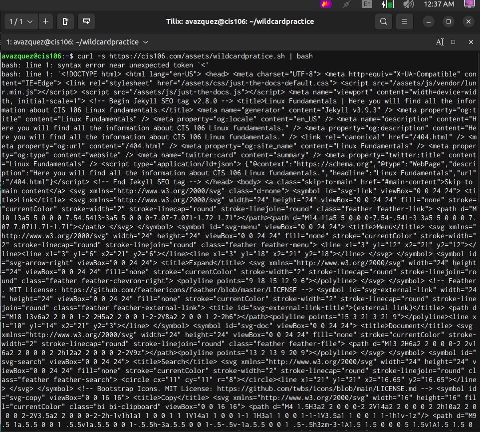
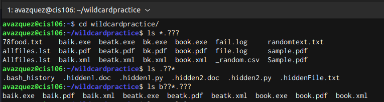

# Week Report 6

## Practice 5

 

 

## Practice 6 

 

 

## Practice 7 

 

## Brace Expansion

The brace expansion makes it possible to utilize commands to create unique strings. It is not a wildcard, either. A few examples include:  
* To create a file hierarchy is: 
  * touch ~/lab6-q5/movies/{movies.lst,marvel.txt,disney.doc}
* To create a whole directory hierarchy:
  * mkdir ~/different-fooddishes/food/{dish1.lst,dish2.txt,dish3.doc}
* To remove files
  * rm ~/lab6-q5/{program.py,people.csv,/movies/{disney.doc,marvel.txt}}
