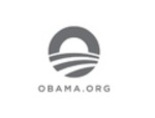

# Deliverable 1 Submission

## Basic Terminology

### What is a web server?
Web servers can be either software, hardware, or a mix of the two. A web server is a machine that houses web server software and the files that make up a website on the hardware side. A web server's software consists of a number of components that regulate how hosted files are accessed by web users.  

## What is Apache?
Apache is a web server software that works with HTTP requests. Apache can be installed using customary package management programs since it is part of Ubuntu's usual software repositories. 

### What are some example web server applications?

| Application Name   | license                          | Project's Website                                |
| ------------------ | -------------------------------- | ------------------------------------------------ |
| Word Press         | GNU General Public License (GPL) | [example 1](https://www.obama.org/)              |
| Apache HTTP Server | Apache License 2.0               | [example 2](https://www.adobe.com)               |
| Jquery             | MIT license                      | [example 3](https://visualstudio.microsoft.com/) |

#### Example 1
 
Obama Foundation launched their Website and is Powered by WordPress. It was founded in 2014 as a tax-exempt 501(c)(3) nonprofit organization to carry out the lifelong objectives of President and Mrs. Obama. 

#### Example 2
 
Adobe is one of the many website examples that uses Apache server. Projects like portfolios, resumes, presentations, blogs, and photo galleries are created in for Adobe. 

#### Example 3
 
Microsoft has used Jquery in their projects. As jQuery has been added to ASP.NET toolkits and is included in a number of the default Web project templates in Visual Studio 2010. 

### What is virtualization?
Virtualization is when you create virtual versions of something. It can be physical or logical and is used to run multiple operating systems on a virtual machine. 

### What is virtualbox?
 
A virtual box is a virtualization product for enterprise from AMD64/Intel64. It is high performance and freely available as open source software. 

### What is a virtual machine?
A virtual machine is the computer system's virtualization. The functionality of a physical computer is given by virtual machines, which are built on computer systems.  

### What is Ubuntu Server?

 

Ubuntu server is a type of operating system. It is a free open source. Ubuntu is a type of Linux distribution that branched out from Debian. 

### What is a firewall?
A firewall is a device (either a router, a dedicated device, or a computer running special software) that selectively filters or blocks traffic between networks.

### What is SSH? 
Secure Shell is a remote connection utility that provides authentication and encryption. SSH is used to log onto a host, execute commands on that host, and copy files to or from the host.

## Other Relevant Concepts/New Concepts Learned
* **Systemd** supplies a variety of Linux-based features
* **Virtual hosts** Virtual Host enables running several websites on a single device or web server
* **Port 88** UDP port 88 uses the Datagram Protocol, a communications protocol for the Internet network layer, transport layer, and session layer. This protocol when used over PORT 88 makes possible the transmission of a datagram message from one computer to an application running in another computer.
* **Systemctl Command** This command controls both system and service configurations, giving administrators access to the OS and service performance.