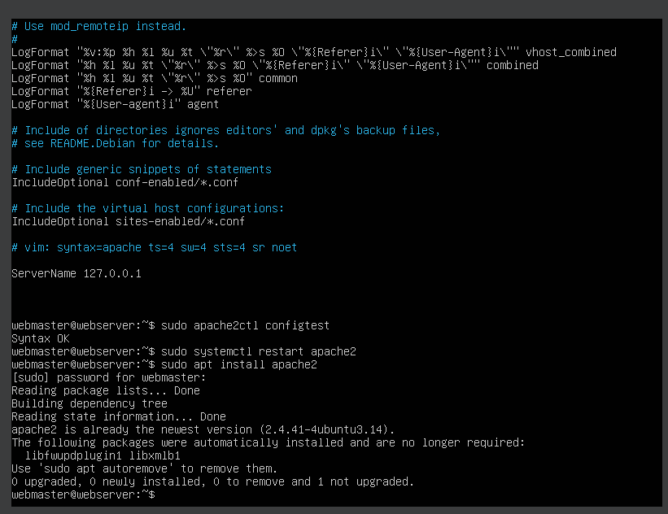

# Deliverable 2 Submission

## Working with Ubuntu Server and Apache 

### Create a virtual machine for the server

 Attached is an image showcasing the created virtual machine that meets the following specifications like the CPU of 1 Core, RAM of 1 GB and hard disk drive of 10 GB

### Install Ubuntu Server 

 Attached is an image of the installation of Ubuntu Server. Screenshot of the login screen to the server right after you log in to the server

### Install Apache2

 Attached is an image of the installation of Apache2 

## Showcasing Command Status

 Attached is an image of the following commands:
* systemctl status apache2 --no-pager
* systemctl status sshd --no-pager
* systemctl status ufw --no-pager

## Showcasing Last 10 lines of the following files

Attached is an image of the following commands:
* Apache: access.log
* Apache: error.log
* SSH: auth.log

## Screenshot of the following configuration:

Attached are images of the configuration of:
* sites-available config file
* apache2.conf

## Image of the ip address & Website attempt accessed
Attached is a screenshot of the IP showing and the attempt to show the sample document. 
