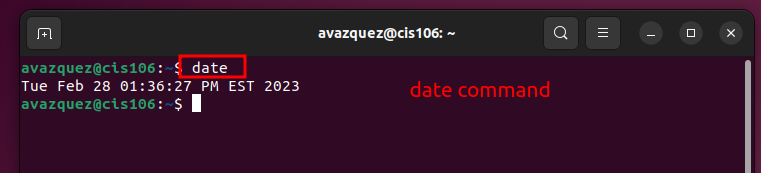
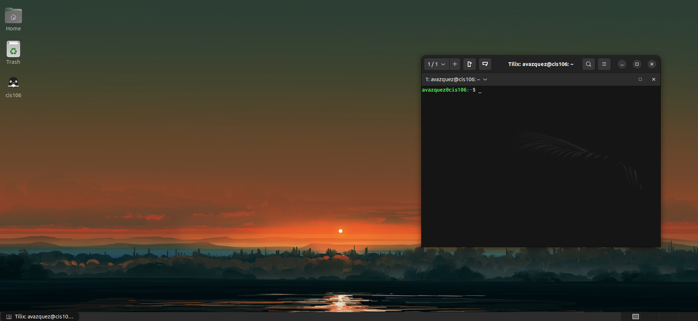

# Lab 3 Submission 

## Question 1

## Question 2

## Question 3
| Program purpose     | Package Name     | Version             |
| ------------------- | ---------------- | ------------------- |
| Play a tetris game  | blockattack      | 2.7.0.1             |
| Play a video file   | dragonplayer     | 4:21.12.3 -0ubuntu1 |
| Browse the internet | epiphany-browser | 42.2-0ubuntu1       |
| Read your email     | plasma-gmailfeed | 1.1-2               |
| Play music          | cynthiune.app    | 1.0.1-2build5       |

## Question 4
| command | what it does                                                                                                  |
| ------- | ------------------------------------------------------------------------------------------------------------- |
| echo    | Outputs string of information of user commands in rainbow font                                                |
| fortune | Outputs the UNIX reference manual in rainbow text                                                             |
| cowsay  | Displays the games manual, information of  the description, environment, format, etc.                         |
| lolcat  | Displays the games manuel, info. on the description,  options, examples, etc.                                 |
| figlet  | Displays information of figlet including the history, authors,  files, bugs, etc.                             |
| toilet  | Displays FORTUNE(6)                                      UNIX Reference Manual     in blue-white box format   |
| rig     | Outputs all info. of rig(6) games manuel, the content is shown in a display border of a boy holding the info. |